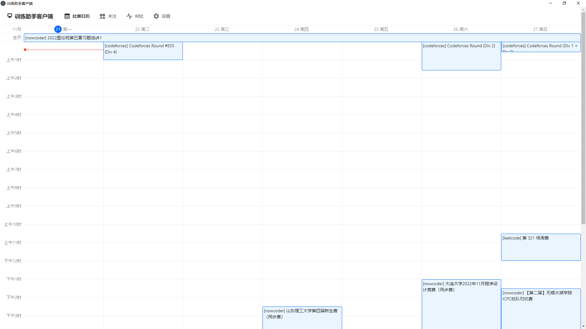
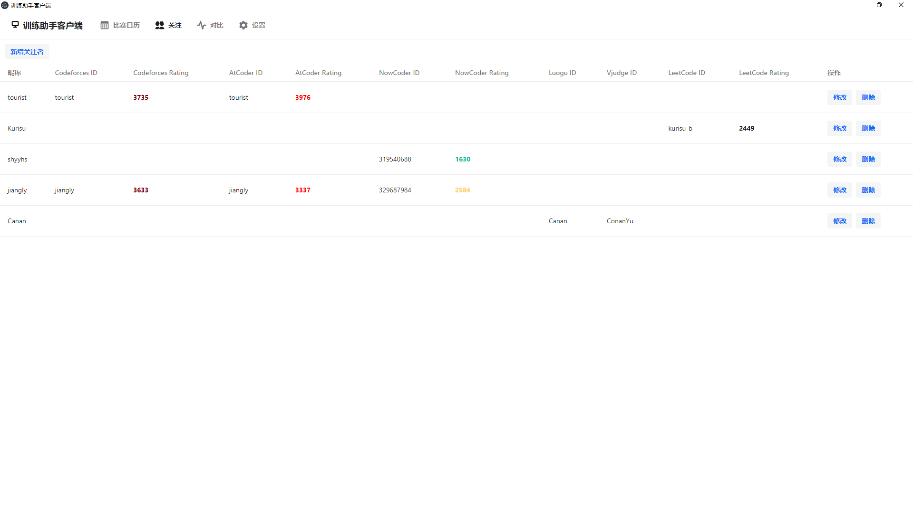
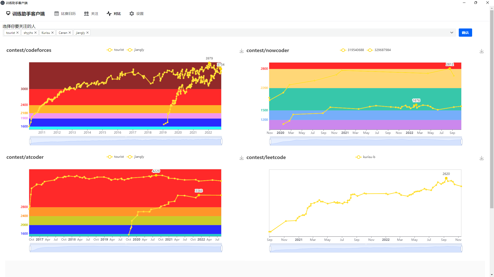

# goodguy-desktop

## 简介

算法竞赛训练助手客户端（目前仅支持windows）

## 功能介绍

### 比赛日历

展示最近的比赛日历。

### 关注

管理关注的人，展示每个人的分数。

### 对比

进行多个人数据的对比。

## 使用方法

在[releases](https://github.com/goodguy-project/goodguy-desktop/releases)找到最新版本的7z压缩文件，解压后启动goodguy-desktop下的bat文件即可使用。
